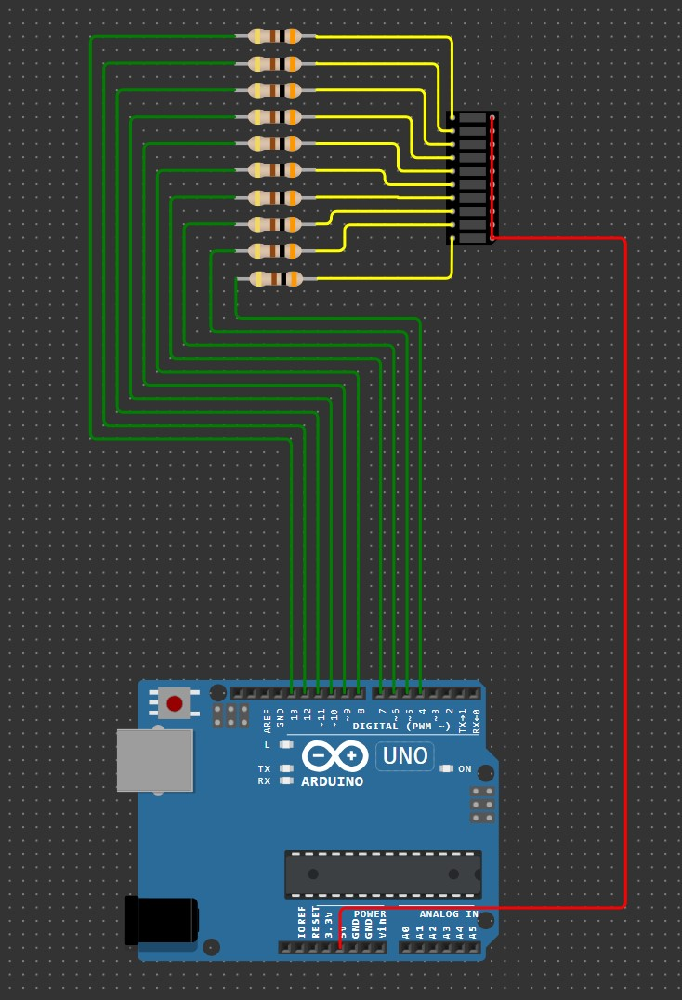

# Домашнее задание к занятию «Знакомство с IoT»

### Инструкция по выполнению домашнего задания
**1.** Зарегистрируйтесь на сайте **[wokwi.com](https://wokwi.com/)**.  
**2.** Перейдите в раздел **Start from Scratch** и выберите создание нового проекта на основе платы **Arduion UNO**. 
**3.** После завершения проверки работоспособности сохраните проект с помощью кнопки **SAVE**. 
**4.** Скопируйте ссылку на проект с помощью кнопки **SHARE**. 
**5.** Скопированную ссылку на ваше решение ДЗ нужно отправить на проверку. Для этого перейдите в личный кабинет на сайте **[netology.ru](https://netology.ru/)**, в поле комментария к домашней работе вставьте скопированную ссылку и отправьте работу на проверку.

### Задача №2. Светодиодная линейка: последовательное заполнение

Соберите в симуляторе Wokwi схему, состоящую из платы Arduino UNO, восьми резисторов номиналом 300 Ом и одной светодиодной линейки LED Bar Graph.

Соберите схему так, чтобы аноды всех светодиодов были объединены и подключены к цепи +5V. Катодами светодиодов необходимо управлять разными выводами платы Arduino UNO.

Разработайте программу, реализующую последовательное включение сегментов светодиодной линейки снизу вверх с задержкой 0,5 сек. После заполнения всех сегментов необходимо их последовательно выключить сверху вниз с задержкой 1 сек.

Проведите моделирование работы в симуляторе.

