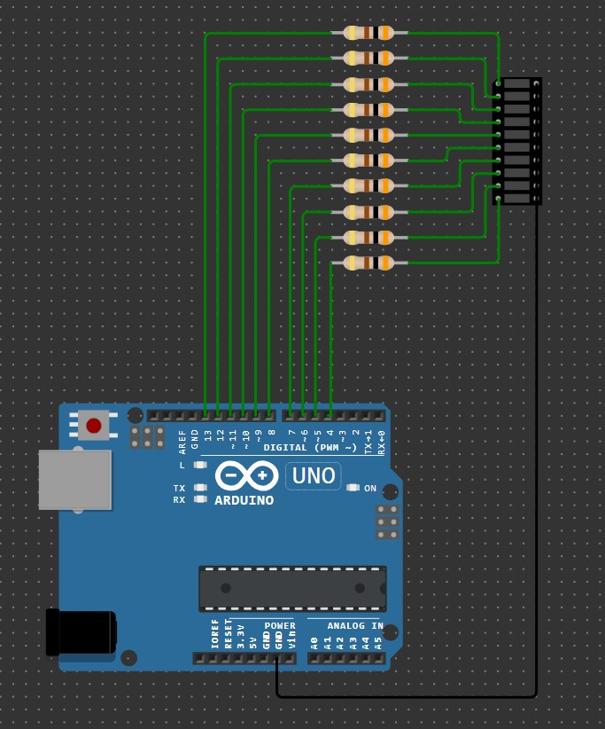

# Домашнее задание к занятию «Знакомство с IoT»

### Инструкция по выполнению домашнего задания
**1.** Зарегистрируйтесь на сайте **[wokwi.com](https://wokwi.com/)**.  
**2.** Перейдите в раздел **Start from Scratch** и выберите создание нового проекта на основе платы **Arduion UNO**. 
**3.** После завершения проверки работоспособности сохраните проект с помощью кнопки **SAVE**. 
**4.** Скопируйте ссылку на проект с помощью кнопки **SHARE**. 
**5.** Скопированную ссылку на ваше решение ДЗ нужно отправить на проверку. Для этого перейдите в личный кабинет на сайте **[netology.ru](https://netology.ru/)**, в поле комментария к домашней работе вставьте скопированную ссылку и отправьте работу на проверку.

## [Задача №3. Светодиодная линейка: «бегающий огонёк»](Running_light)

Соберите в симуляторе Wokwi схему, состоящую из платы Arduino UNO, восьми резисторов номиналом 300 Ом и одной светодиодной линейки LED Bar Graph.

Соберите схему так, чтобы катоды всех светодиодов были объединены и подключены к цепи GND. Анодами светодиодов необходимо управлять разными выводами платы Arduino UNO.

Разработайте программу, реализующую на светодиодной линейке бегающий огонёк: последовательное перемещение активного сегмента снизу вверх. При достижении верхнего сегмента следует переходить к самому нижнему. Задержка перемещения бегающего огонька должна последовательно уменьшаться после каждого цикла (последовательный перебор всех сегментов один раз) из ряда: 1 сек, 0,5 сек, 0,25 сек, 0,1 сек. После выполнения цикла с задержкой 0,1 сек следует вернуться к задержке 1 сек.

Проведите моделирование работы в симуляторе.

### Правила приёма домашней работы

Чтобы сдать домашнее задание, прикрепите в личном кабинете ссылку на проект.

### Критерии оценки домашней работы

В личном кабинете прикреплена ссылка на проект для заданий 1, 2 и 3.

