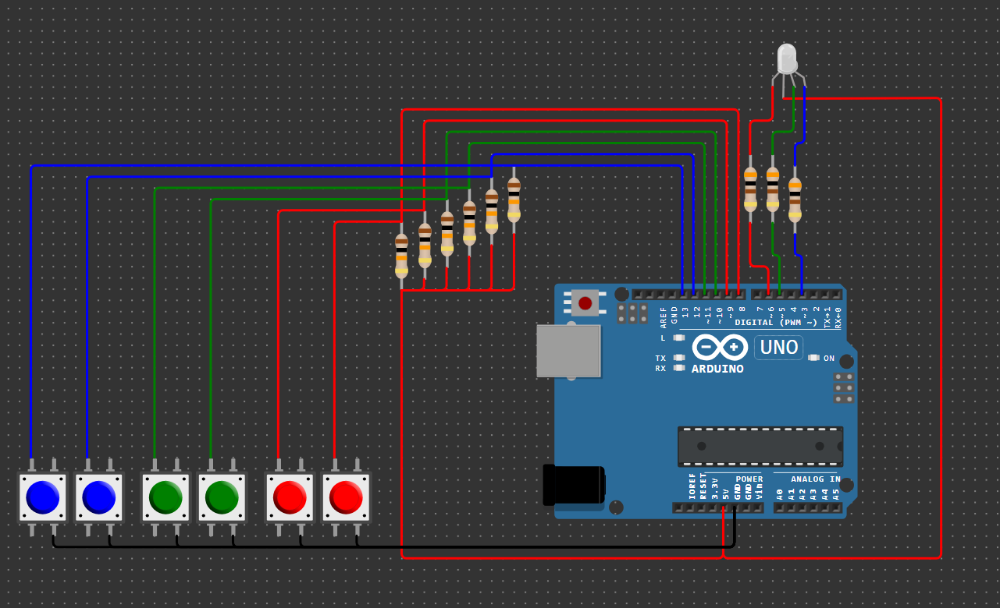

# Домашнее задание к занятию «Управление цифровыми входами и выходами»

### Инструкция по выполнению домашнего задания

**1.** Зарегистрируйтесь на сайте **[wokwi.com](https://wokwi.com/)**. 
**2.** Перейдите в раздел **Start from Scratch** и выберите создание нового проекта на основе платы **Arduion UNO**. 
**3.** После завершения проверки работоспособности сохраните проект с помощью кнопки **SAVE**. 
**4.** Скопируйте ссылку на проект с помощью кнопки **SHARE**. 
**5.** Скопированную ссылку на ваше решение ДЗ нужно отправить на проверку. Для этого перейдите в личный кабинет на сайте **[netology.ru](https://netology.ru/)**, в поле комментария к домашней работе вставьте скопированную ссылку и отправьте работу на проверку.

## [Задача №2. Изменение цвета и яркости трёхцветного светодиода](Brightness_contol_RGB_Diode)

Соберите в симуляторе Wokwi схему, состоящую из платы Arduino UNO, трёх резисторов номиналом 300 Ом, одного трёхцветного светодиода RGB LED и шести кнопок. По умолчанию общий вывод трёхцветного светодиода объединяет аноды светодиодов, то есть к нему нужно подвести +5V.

Соберите схему так, чтобы красный, зелёный и синий сегменты светодиода управлялись разными выводами платы Arduino UNO, для которых доступна функция analogWrite().

Разработайте программу, в которой будет реализовано независимое управление яркостью каждого сегмента светодиода, по две кнопки на каждый сегмент: при нажатии на одну происходит уменьшение яркости соответствующего сегмента, при нажатии на другую — увеличение яркости. Диапазон изменения яркости — от 0 до 250, шаг изменения яркости — 50. Должно быть предусмотрено подавление дребезга контактов для каждой кнопки. Выделите законченные логические блоки программы в отдельные функции.

Проведите моделирование работы в симуляторе.

