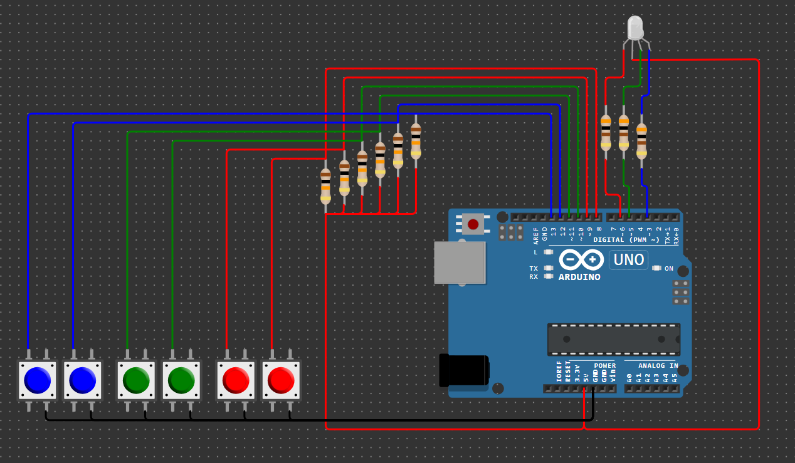

# Домашнее задание к занятию «Управление цифровыми входами и выходами»

### Инструкция по выполнению домашнего задания

**1.** Зарегистрируйтесь на сайте **[wokwi.com](https://wokwi.com/)**. 
**2.** Перейдите в раздел **Start from Scratch** и выберите создание нового проекта на основе платы **Arduion UNO**. 
**3.** После завершения проверки работоспособности сохраните проект с помощью кнопки **SAVE**. 
**4.** Скопируйте ссылку на проект с помощью кнопки **SHARE**. 
**5.** Скопированную ссылку на ваше решение ДЗ нужно отправить на проверку. Для этого перейдите в личный кабинет на сайте **[netology.ru](https://netology.ru/)**, в поле комментария к домашней работе вставьте скопированную ссылку и отправьте работу на проверку.

## Задача №3. Разработка пользовательской библиотеки]

Доработайте предыдущую задачу так, чтобы функции, отвечающие за обработку кнопок и за управление трёхцветным светодиодом, были выделены в отдельные библиотеки.

Библиотеки добавьте в проект симулятора Wokwi с помощью кнопки **Upload file(s)...**. 

Проведите моделирование работы в симуляторе.

### Правила приёма домашней работы

Чтобы сдать домашнее задание, прикрепите в личном кабинете ссылку на проект.

### Критерии оценки домашней работы

В личном кабинете прикреплена ссылка на проект для заданий 1, 2 и 3.

