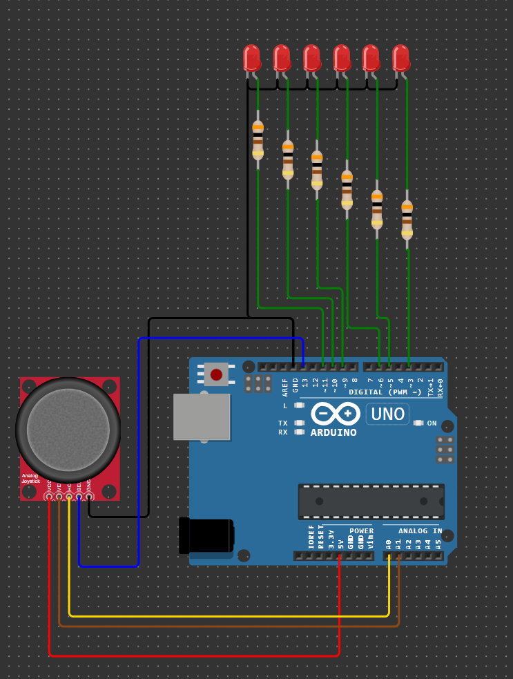

# Домашнее задание к занятию 3 «Устройства ввода данных»
### Инструкция по выполнению домашнего задания
**1.** Зарегистрируйтесь на сайте **[wokwi.com](https://wokwi.com/)**. 
**2.** Перейдите в раздел **Start from Scratch** и выберите создание нового проекта на основе платы **Arduion UNO**. 
**3.** После завершения проверки работоспособности сохраните проект с помощью кнопки **SAVE**. 
**4.** Скопируйте ссылку на проект с помощью кнопки **SHARE**. 
**5.** Скопированную ссылку на ваше решение нужно отправить на проверку. Для этого перейдите в личный кабинет на сайте **[netology.ru](https://netology.ru/)**, в поле комментария к домашней работе вставьте скопированную ссылку и отправьте работу на проверку.

------------

## Задача №2. Управление яркостью и положением сегмента светодиодной линейки с помощью аналогового джойстика

Соберите в симуляторе Wokwi схему, состоящую из платы Arduino UNO, шести резисторов номиналом 300 Ом, шести светодиодов LED и одного аналогового джойстика. Светодиоды должны сформировать линейку из шести элементов. Соберите схему так, чтобы катоды всех светодиодов были подключены к цепи GND. Анодами шести светодиодов необходимо управлять разными выводами платы Arduino UNO, для которых доступно использование функции analogWrite(). Джойстик подключите к линиям питания GND и +5V, его аналоговые выводы подключите к аналоговым входам платы Arduino UNO, а выход кнопки джойстика — к любому входу платы Arduino UNO. 
Разработайте программу, в которой перемещение джойстика по оси Х приводит к перемещению активного сегмента светодиодной линейки без переноса между младшим и старшим сегментом, а перемещение по оси Y — к изменению яркости. Аналоговые каналы джойстика обрабатывать с периодом 100 мс. Факт перемещения джойстика обрабатывать по пороговой функции, то есть важен только сам факт отклонения джойстика от центра, а не его абсолютное значение. Яркость изменять в диапазоне от 0 до 250, шаг изменения яркости — 10. При нажатии на кнопку джойстика активный сегмент светодиодной линейки должен переместиться в младшее положение. Должно быть предусмотрено подавление дребезга контактов кнопки. Выделите законченные логические блоки программы в отдельные функции. 
Проведите моделирование работы в симуляторе. 

