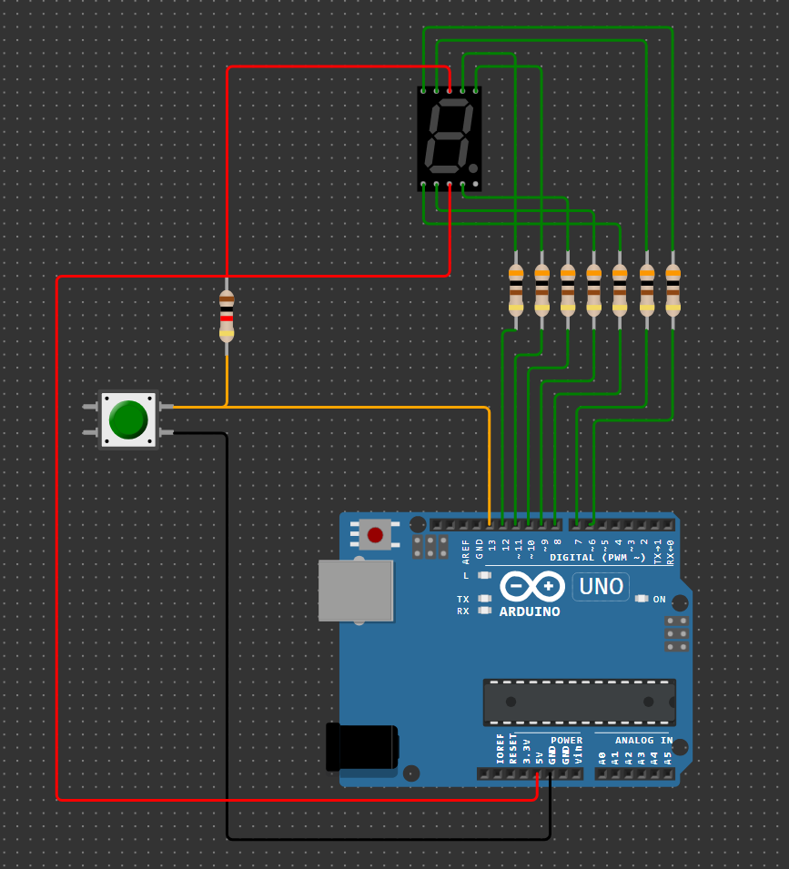

# Домашнее задание к занятию 4. Устройства индикации
### Инструкция по выполнению домашнего задания:
**1.** Зарегистрируйтесь на сайте **[wokwi.com](https://wokwi.com/)**; 
**2.** Перейдите в раздел **Start from Scratch** и выберите создание нового проекта на основе платы **Arduion UNO**; 
**3.** После завершения проверки работоспособности сохраните проект с помощью кнопки **SAVE**; 
**4.** Скопируйте ссылку на проект с помощью кнопки **SHARE**; 
**5.** Скопированную ссылку (ваше решение ДЗ) нужно отправить на проверку. Для этого перейдите в личный кабинет на сайте **[netology.ru](https://netology.ru/)**, в поле комментария к домашней работе вставьте скопированную ссылку и отправьте работу на проверку;

------------

## Задача №1. Подсчет числа нажатий на кнопку с помощью одноразрядного семисегментного индикатора

Соберите в симуляторе WOKWI схему, состоящую из платы Arduino UNO, семи резисторов номиналом 300 Ом, семисегментного индикатора и кнопки. По умолчанию общий вывод семисегментного индикатора подключен к анодам сегментов, поэтому его необходимо подключить к цепи +5V. Катоды сегментов подключите к любым выводам платы Arduino UNO. Также к любому выводу платы Arduino UNO подключите кнопку. 

Разработайте программу, которая подсчитывает количество нажатий на кнопку и выводит это значение на семисегментный индикатор в виде шестнадцатеричного кода числа (т.е. цифры от 0 до 9 и буквы: A, b, C, d, E, F). При нажании кнопки в состоянии F должен происходить переход в состояние 0. Предусмотреть подавление дребезга контактов кнопки. Выделите законченные логические блоки программы в отдельные функции. 

Проведите моделирование работы в симуляторе. 

