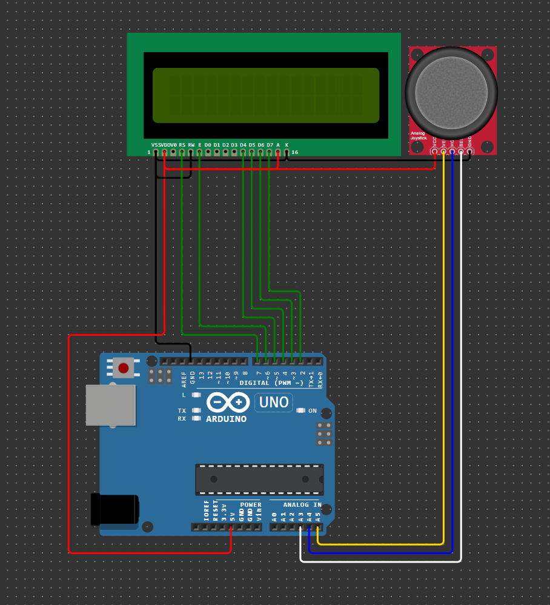

# Домашнее задание к занятию 4. Устройства индикации
### Инструкция по выполнению домашнего задания:
**1.** Зарегистрируйтесь на сайте **[wokwi.com](https://wokwi.com/)**; 
**2.** Перейдите в раздел **Start from Scratch** и выберите создание нового проекта на основе платы **Arduion UNO**; 
**3.** После завершения проверки работоспособности сохраните проект с помощью кнопки **SAVE**; 
**4.** Скопируйте ссылку на проект с помощью кнопки **SHARE**; 
**5.** Скопированную ссылку (ваше решение ДЗ) нужно отправить на проверку. Для этого перейдите в личный кабинет на сайте **[netology.ru](https://netology.ru/)**, в поле комментария к домашней работе вставьте скопированную ссылку и отправьте работу на проверку;

------------

## Задача №3. Управление жидкокристаллическим индикатором с помощью аналогового джойстика

Соберите в симуляторе WOKWI схему, состоящую из платы Arduino UNO, жидкокристаллического индикатора 16 х 2 и аналогового джойстика. Джойстик подключите к линиям питания GND и +5V, его аналоговые выводы подключите к аналоговым входам платы Arduino UNO, а выход кнопки джойстика - к любому входу платы Arduino UNO. Подключите жидкокрисллический индикатор к оставшимся свободным выводам платы Arduino UNO. 

Разработайте программу, в  которой перемещение джойстика по оси Х приводит к перемещению курсора по строке жидкокристаллического индикатора, а перемещение по оси Y - к выбору символа из диапазона от A до Z (обратитесь к таблице кодов ASCII). Нажатие на кнопку джойстика переключает активную строку жидкокристаллического индикатора. Для управления жидкокристаллическим индикатором использовать готовую библиотеку. Выделите законченные логические блоки программы в отдельные функции. 

Проведите моделирование работы в симуляторе. 

