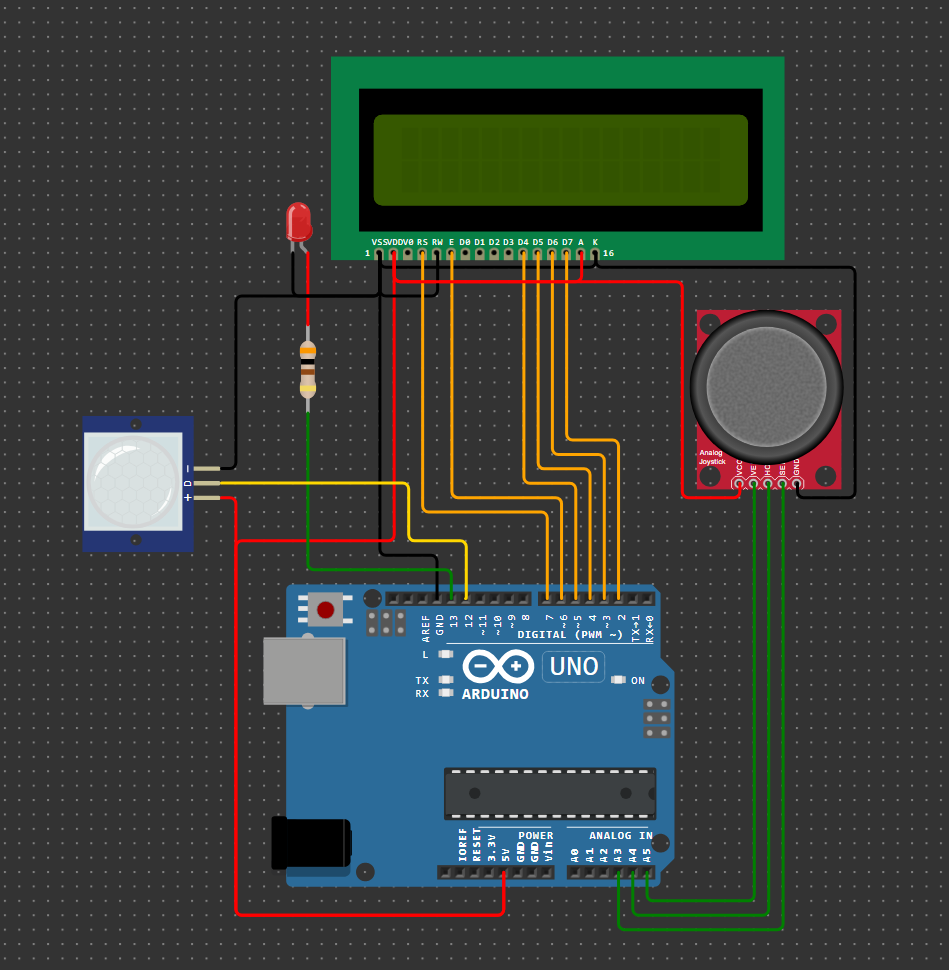

# Домашнее задание к занятию 5. «‎Обработка датчиков»
### Инструкция по выполнению домашнего задания
**1.** Зарегистрируйтесь на сайте **[wokwi.com](https://wokwi.com/)**. 
**2.** Перейдите в раздел **Start from Scratch** и выберите создание нового проекта на основе платы **Arduion UNO**. 
**3.** После завершения проверки работоспособности сохраните проект с помощью кнопки **SAVE**. 
**4.** Скопируйте ссылку на проект с помощью кнопки **SHARE**. 
**5.** Скопированную ссылку на ваше решение ДЗ нужно отправить на проверку. Для этого перейдите в личный кабинет на сайте **[netology.ru](https://netology.ru/)**, в поле комментария к домашней работе вставьте скопированную ссылку и отправьте работу на проверку.

------------

## Задача №3. Управление освещением с помощью датчика движения

Соберите в симуляторе Wokwi схему, состоящую из платы Arduino UNO, жидкокристаллического индикатора 16 х 2, аналогового джойстика, резистора номиналом 300 Ом, светодиода и датчика движения. Джойстик подключите к линиям питания GND и +5V, его аналоговые выводы подключите к аналоговым входам платы Arduino UNO, а выход кнопки джойстика — к любому входу платы Arduino UNO. Подключите жидкокристаллический индикатор, светодиод и датчик движения к оставшимся свободным выводам платы Arduino UNO. 

Разработайте программу, в которой светодиод включается при наличии сигнала от датчика движения. Светодиод должен выключиться через время, которое задаётся с помощью джойстика и жидкокристаллического индикатора, алгоритм взаимодействия джойстика и индикатора нужно разработать самостоятельно. Время работы светодиода должно задаваться в диапазоне от 2 до 10 секунд с шагом 1 секунда. Выделите законченные логические блоки программы в отдельные функции. 

Проведите моделирование работы в симуляторе. 

