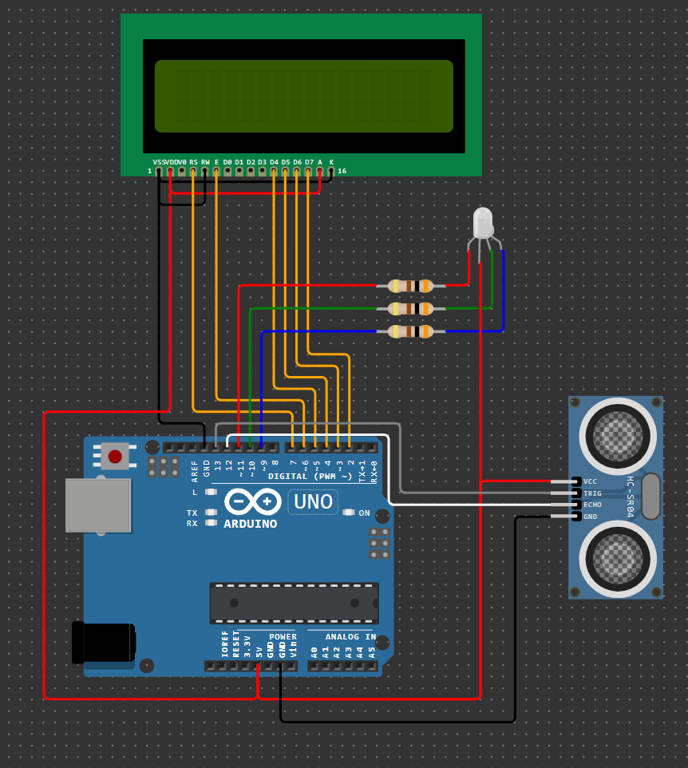

# Домашнее задание к занятию 5. «‎Обработка датчиков»
### Инструкция по выполнению домашнего задания
**1.** Зарегистрируйтесь на сайте **[wokwi.com](https://wokwi.com/)**. 
**2.** Перейдите в раздел **Start from Scratch** и выберите создание нового проекта на основе платы **Arduion UNO**. 
**3.** После завершения проверки работоспособности сохраните проект с помощью кнопки **SAVE**. 
**4.** Скопируйте ссылку на проект с помощью кнопки **SHARE**. 
**5.** Скопированную ссылку на ваше решение ДЗ нужно отправить на проверку. Для этого перейдите в личный кабинет на сайте **[netology.ru](https://netology.ru/)**, в поле комментария к домашней работе вставьте скопированную ссылку и отправьте работу на проверку.

------------

## Задача №2. Ультразвуковой парктроник

Соберите в симуляторе Wokwi схему, состоящую из платы Arduino UNO, ультразвукового дальномера, жидкокристаллического индикатора 16 х 2, трёх резисторов номиналом 300 Ом и одного RGB-светодиода. Подключите ультразвуковой дальномер, жидкокристаллический индикатор и RGB-светодиод к выводам платы Arduino UNO. 

Разработайте программу, которая измеряет расстояние до препятствия с периодичностью в 100 мс. Информация об измеренной дальности должна отображаться на жидкокристаллическом индикаторе в метрах с точностью до десятых долей. Если расстояние находится в диапазоне от 2 до 4 метров, то RGB-светодиод должен непрерывно светиться. Если расстояние находится в диапазоне от 1 до 2 метров, то RGB-светодиод должен моргать жёлтым светом с периодичностью 500 мс. Если расстояние менее 1 метра, то RGB-светодиод должен моргать красным светом с периодичностью 100 мс. Выделите законченные логические блоки программы в отдельные функции. 

Проведите моделирование работы в симуляторе. 

